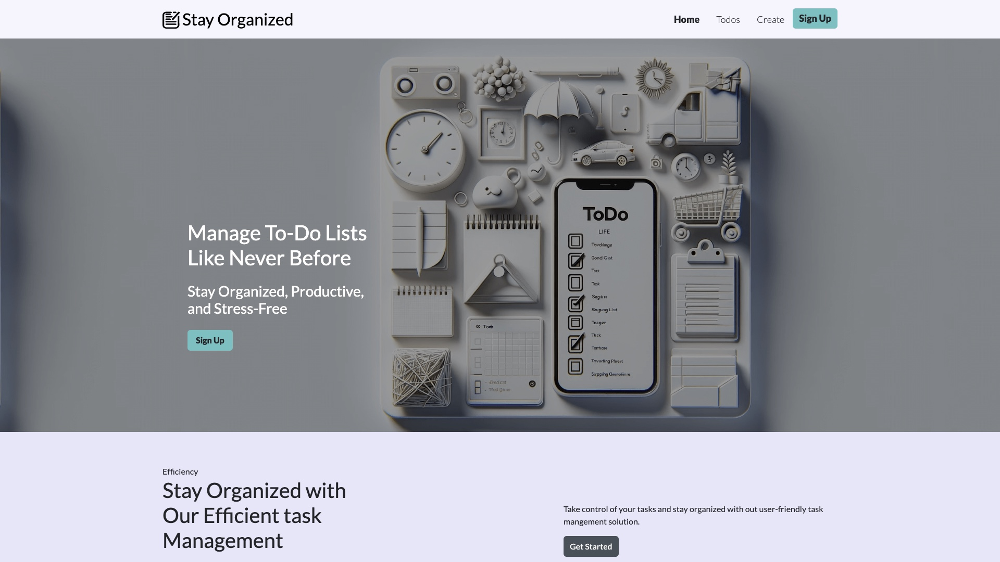
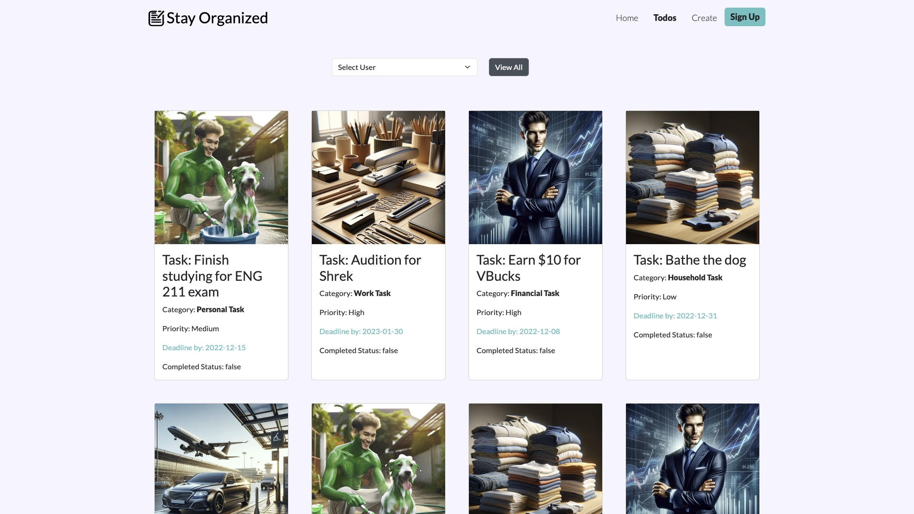
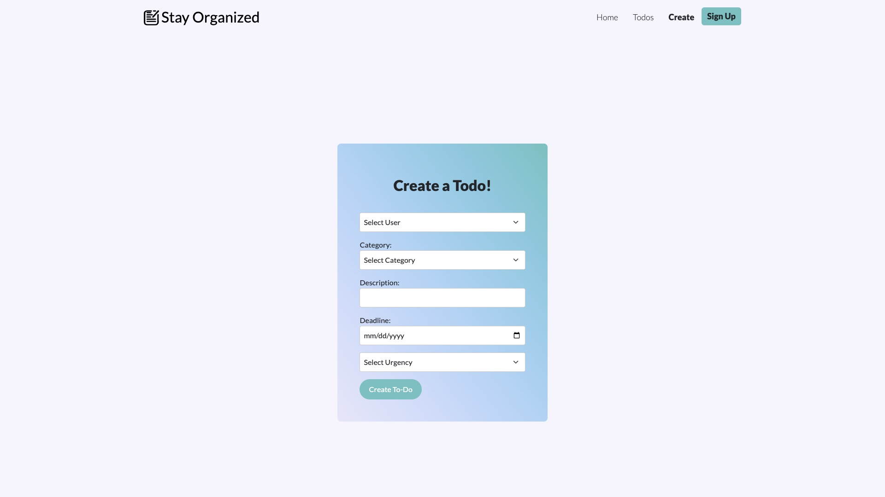
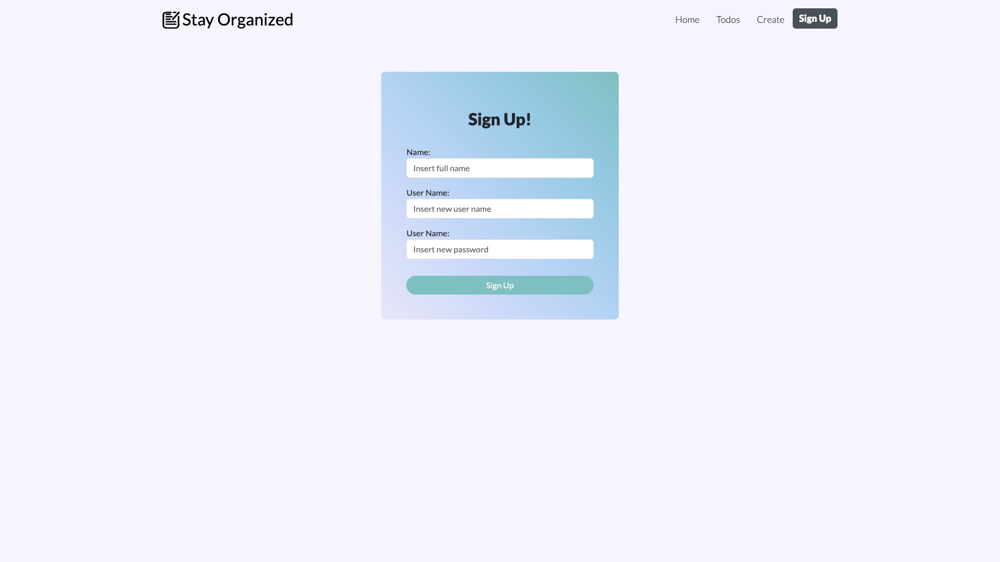

## <a href="https://javirb26.github.io/WorkBook8_StayOrganized/">Visit site</a>
# Stay Organized - ToDo List Web Application

## Overview
Welcome to the Stay Organized ToDo List Web Application, a dynamic and user-friendly platform designed to help individuals keep track of their tasks and manage their time efficiently. This project centers around building a website that allows users to maintain a list of tasks they need to accomplish, complete with categories, descriptions, deadlines, and priority levels.


## Features

* View ToDo Tasks: Users can view a list of their tasks, each detailed with a category, description, deadline, and priority status.
* Add ToDo Tasks: Users can easily add new tasks to their list, assigning them a category, description, deadline, and priority level.


## Example Task:

```
Category: "Personal Task"
Description: "Finish studying for ENG 211 exam"
Deadline: "2022-12-15"
Priority: "Medium"

```


## Technical Details
* REST API Integration: The website interfaces with a REST API, providing seamless access to a back-end data store.

* Data Store: The back-end data store contains user information and their corresponding ToDo tasks.

* User-Specific Interaction: The application allows for viewing and adding tasks specific to a registered user.
## Primary Objectives

1. Viewing Tasks: Enable users to view their list of tasks in an organized and intuitive manner.

2. Adding Tasks: Provide a simple and efficient interface for users to add new tasks to their list.

3. Creating User: Allow users to sign up or create a user to then add todo tasks to later on.

## Screenshots

### Home 


### Todos


### Create Todo


### Sign Up


## Technologies Used

* [JavaScript, CSS3, HTML5, Bootstrap]

## Color Refrence

| Color             | Hex                                                                |
| ----------------- | ------------------------------------------------------------------ |
| Pale Lavendar |  #E6E6FA |
| White Smoke |  #F5F5FF |
| Semi Gray|  #c2c2cc33 |
| Charcoal |  #2C2C2C |
| Robin Egg Blue |  #00C6C2 |
| Outer Space |  #435058 |

## Authors

- [@javirb26](https://www.github.com/javirb26)
- [@TeeeCodes](https://www.github.com/TeeeCodes)
- [@toriasellers](https://www.github.com/toriasellers)


